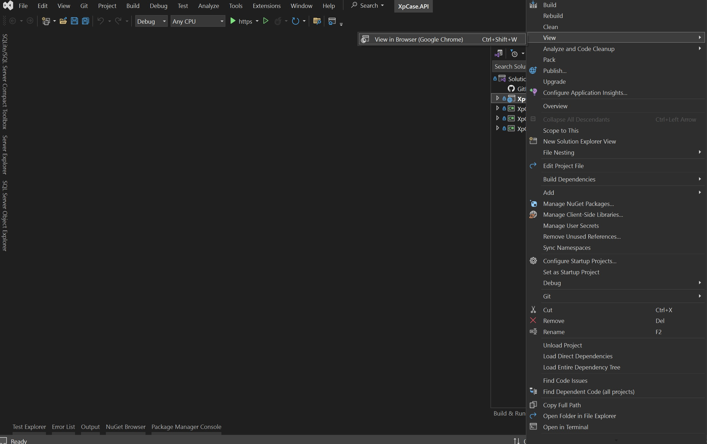
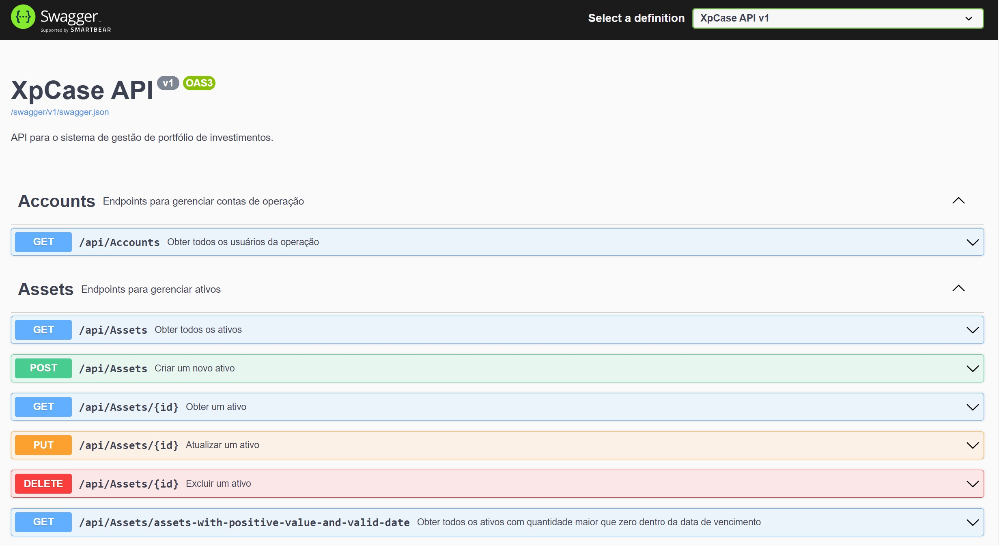
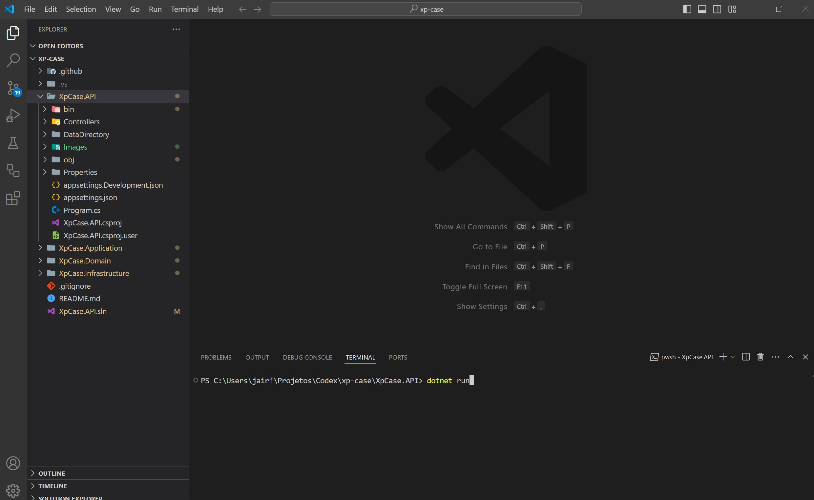

# XP Case
Essa aplicação (API) simula um ambiente de uma corretora para investimentos em ações.

## Como executar

<strong> Visual Studio</strong>
 
 Defina o projeto <b>XpCase.API</b> como principal e pressione Ctrl+F5 para executar ou clique com botão direito em cima do projeto e navegue até <code>View > View in Browser</code> conforme a imagem abaixo:
     

     
  Acesse pelo navegador o endereço: <b>https://localhost:7060/swagger/index.html</b> para visualizar os endpoint da aplicação conforme a imagem abaixo:    
  

<strong> Visual Code</strong>
 
No terminal acesse o projeto <b>XpCase.API</b> e execute o comando <code>dotnet run</code> conforme a imagem abaixo:     

     
  Acesse pelo navegador o endereço: <b>http://localhost:5175/swagger/index.html</b> para visualizar os endpoint da aplicação conforme a imagem abaixo:     
  

## Como utilizar
Já há dados previamente cadastrados nas tabelas que apoiam a compra e venda de uma ação. Obtenha os dados em:

<b>Assets (Ativos)</b> 
Em <code>GET/api/Assets/assets-with-positive-value-and-valid-date</code> obtenha a lista dos ativos disponíveis para negociação.  

<b>Customers (Clientes)</b> 
Em <code>GET/api/Customers</code> obtenha a lista de clientes.  

<b>Orders (Ordens)</b> 
Com os dados de ativos e clientes:  
Execute uma ordem de compra em <code>POST/api/Orders/buy</code>.  
Execute uma ordem de venda em <code>POST/api/Orders/sell</code>.   
Consulte as ordens pendentes para processamento em <code>GET/api/Orders</code>  

<b>Matching Engine</b> 
Essa chamada fará o casamento das ordens, para processar as ordens pendentes ou parciais execute em <code>/api/Orders/execute-batch</code> 

<b>Transactions (Transações)</b> 
Em <code>GET/api/Transactions</code> obtenha a lista de transações de compra, venda, depósito ou saque. 

<b>Wallets (Carteiras)</b> 
Em <code>GET/api/Wallets</code> obtenha a lista de carteiras com os dados dos ativos negociados em Ordens. 

> **Atenção:** Todos os endpoints estão liberados sem o uso do TOKEN para que os consumo/teste fosse feito de forma desburocratizada.
